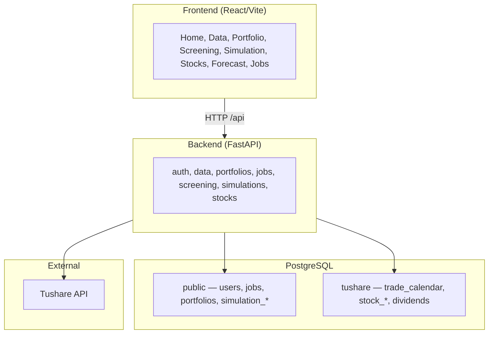

# Architecture

**`docker/docker-compose.yml`** runs PostgreSQL (pgvector/pg16), the FastAPI backend, and an nginx-served frontend at **http://localhost:3200**. The browser talks only to nginx; nginx proxies `/api` to the backend on **8200** inside the Compose network.

## High-level diagram



| Layer | Role |
|-------|------|
| **PostgreSQL `public`** | App tables — users, background jobs, portfolio configs, simulation run metadata and results. See [Data models](features/data-models.md). |
| **PostgreSQL `tushare`** | Market data synced from Tushare (Alembic `002_market_data`). Queried by the trading engine and screening. |
| **Trading engine** | `backend/app/core/` — policies, portfolio simulation, data engines (migrated from the old `src/` tree). |
| **Jobs** | Long-running data sync and simulation tasks run in FastAPI background tasks; status in `jobs` table. |

## Frontend structure

```
frontend/src/
├── App.tsx, main.tsx, index.scss
├── pages/           # Home, DataCollection, Portfolio, Screening, Simulation, …
├── components/      # Layout shell, Chart, Tabs, ProtectedRoute
├── contexts/        # AuthContext
├── hooks/           # useJobPoll
├── utils/api.ts     # fetch helpers + JWT
├── config.ts        # API base URL
└── styles/
    └── design-system/   # SCSS tokens — see design-system.md
```

Routes are declared in `App.tsx`. Page styles are colocated (`App.scss` or page SCSS). Shared chrome lives in `components/Layout/MainLayout.tsx`.

Design tokens and SCSS conventions: [Design system](design-system.md) (derived from openKMS).

## Backend structure

```
backend/
├── app/
│   ├── main.py           # FastAPI app, CORS, routers
│   ├── config.py         # STOCK_* settings
│   ├── database.py       # SQLAlchemy engine + Base
│   ├── auth.py           # JWT (local mode)
│   ├── api/              # REST routers per domain
│   ├── models/           # ORM models (public schema)
│   ├── services/         # Business logic + job runners
│   └── core/             # Trading engine, Tushare sync, simulation
├── alembic/              # Schema migrations (001 app, 002 tushare, 003 portfolios)
├── dev.sh                # venv, migrations, uvicorn :8200
└── tests/
```

Canonical configuration: [Configuration](features/configuration.md).

## Schema migrations

Alembic is the single source of truth for DDL. Run from `backend/` with the project venv:

```bash
source .venv/bin/activate
python -m alembic upgrade head
```

Do not rely on `Base.metadata.create_all` in production — it exists only as a dev convenience in `lifespan`.
