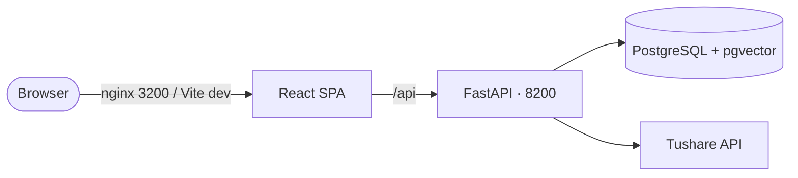

# 股票交易系统

**Personal stock trading system** — backtest, screen, and analyze Chinese A-shares (MA, Donchian, Bollinger, ensemble, ATR policies).

The web app replaces the old Streamlit UI: React SPA + FastAPI backend + PostgreSQL (market data in schema **`tushare`**, portfolios and simulation results in **`public`**).

[Quickstart](quickstart.md){ .md-button .md-button--primary }

---

## What the system does

| Surface | Role |
|---------|------|
| **Data collection** | Sync trade calendar, stock basics, daily OHLCV, adj factors, dividends from Tushare into PostgreSQL |
| **Portfolios** | Create and edit portfolio YAML-style config in the UI (stored as JSON in `portfolios`) |
| **Screening** | Run policy-based stock screens against synced market data |
| **Simulation** | Backtest a portfolio + policy over a date range; persist daily equity and trades |
| **Stock analysis** | OHLCV charts, indicators, and forecast for a single symbol |
| **Jobs** | Background task status for data sync and simulation runs |

North star: a simple, inspectable system for personal quantitative trading research — not a production brokerage.

## Where to start

| If you want to… | Read |
|---|---|
| Run locally (Docker or host) | [Quickstart](quickstart.md) |
| Understand the stack | [Architecture](architecture.md) |
| Find a feature or API route | [Functionalities](functionalities.md) → `features/*.md` |
| Environment variables | [Configuration](features/configuration.md) |
| Database tables | [Data models](features/data-models.md) |
| HTTP reference | [API reference](features/api-reference.md) |
| Host dev setup (venv, Alembic, pgvector) | [Developer setup](developer/setup.md) |
| Docker deployment | [Operations · Docker](operations/docker.md) |
| Frontend tokens and SCSS | [Design system](design-system.md) |

## At a glance

| Service | Default port |
|---|---|
| Frontend (Docker, nginx) | **3200** |
| Frontend (Vite dev) | **3200** (proxies `/api` → backend) |
| Backend (FastAPI) | **8200** |
| PostgreSQL | **5432** (host or Compose internal) |

## Project layout

| Path | What's inside |
|---|---|
| `backend/` | FastAPI API, trading engine (`app/core/`), Alembic, JWT auth |
| `frontend/` | React 19 + Vite SPA (openKMS-derived design system) |
| `docker/` | Dockerfiles and `docker-compose.yml` |
| `docs/` | This documentation site |
