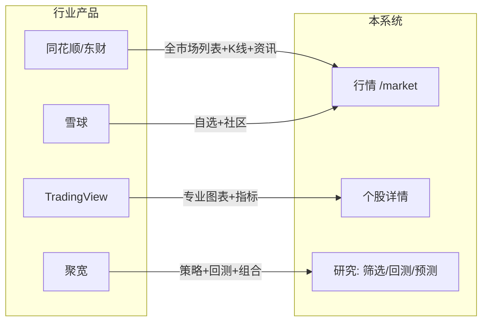

# 产品路线图

本文档对比主流行情/量化产品（同花顺、东方财富、雪球、TradingView、聚宽），梳理当前 **股票交易系统** 的能力差距，并按阶段给出可执行的改进计划。

> 定位不变：个人量化研究与回测工具，**不是**券商级实时交易平台。路线图优先补齐「研究闭环」所需的基础行情体验，再逐步增强分析与交易模拟能力。

---

## 现状速览

| 模块 | 已有能力 | 主要差距 |
|------|----------|----------|
| 行情列表 | `/market` 分页、筛选、排序、自选入库 | 缺 OHLC 列、行业涨跌概览、URL 可分享、全量导出 |
| 个股页 | `/stocks` 指标折线图 | 无 K 线、无统一详情页、无分时/盘口 |
| 数据 | Tushare 日频同步 | 非实时、无分钟线、无新闻/公告 |
| 自选 | 写入 portfolio `follow_stocks` | 无独立自选视图、无分组/排序 |
| 选股/回测 | 策略筛选 + 组合回测 | 与行情/自选联动弱、无组合实盘跟踪 |
| 体验 | 中英文基础 i18n、桌面布局 | 移动端弱、图表交互浅、无暗色行情主题优化 |

---

## 对标参考

| 能力 | 同花顺/东财 | 雪球 | TradingView | 聚宽 | 本系统（当前） |
|------|------------|------|-------------|------|----------------|
| 全市场列表 | ✅ | ✅ | ✅ | ✅ | ✅ Phase 1 |
| 日频收盘行情 | ✅ | ✅ | ✅ | ✅ | ✅ |
| 实时/延时行情 | ✅ | ✅ | 付费 | — | ❌ |
| K 线图 | ✅ | ✅ | ✅ | ✅ | ✅ Phase 1 |
| 技术指标图 | ✅ | 部分 | ✅ | ✅ | ✅ 折线 |
| 行业/板块涨跌 | ✅ | ✅ | — | 部分 | ✅ Phase 1 |
| 独立自选列表 | ✅ | ✅ | ✅ | ✅ | ❌ Phase 2 |
| 条件选股 | ✅ | 部分 | 筛选器 | ✅ | ✅ 策略筛选 |
| 回测 | 部分 | — | 部分 | ✅ | ✅ |
| 新闻/公告/F10 | ✅ | ✅ | — | 部分 | ❌ Phase 4 |
| 移动端 | ✅ | ✅ | ✅ | Web | ❌ Phase 3 |

图例：✅ 已有 · 🚧 进行中 · ❌ 未做

---

## 阶段规划

### Phase 1 — 行情基础体验（当前迭代）

**目标**：让 `/market` → 个股详情形成与同花顺类似的「列表 → K 线」主路径。

| # | 任务 | 说明 | 状态 |
|---|------|------|------|
| 1.1 | 行情列表 OHLC + 成交额列 | `universe` API 返回 open/high/low/amount | ✅ |
| 1.2 | 数据时效说明 | 标注「日频收盘数据，非实时」 | ✅ |
| 1.3 | URL 同步筛选条件 | `?q=&industry=&chip=` 可分享、可刷新保持 | ✅ |
| 1.4 | 行业涨跌概览条 | `GET /universe/industry-summary` + 横向滚动条 | ✅ |
| 1.5 | 个股详情页 `/stocks/:tsCode` | 报价条 + K 线 + 成交量副图 | ✅ |
| 1.6 | K 线组件 | ECharts candlestick + volume | ✅ |
| 1.7 | 当前页 CSV 导出 | 客户端导出可见筛选结果（当前页） | ✅ |
| 1.8 | 文档与 API 测试 | `api-reference`、单元测试 | ✅ |

**验收**：从行情表点击任一行进入 K 线详情；筛选状态写入 URL；行业概览可点选过滤。

---

### Phase 2 — 自选与研究联动

**目标**：缩小与雪球/聚宽在「盯盘 + 研究」上的差距。

| # | 任务 | 说明 |
|---|------|------|
| 2.1 | 独立自选页 `/watchlist` | 聚合所有 portfolio 的 `follow_stocks`，展示迷你行情 |
| 2.2 | 自选分组 | portfolio 即分组；支持快速切换默认组合 |
| 2.3 | 行情 → 筛选 | 从行业/涨跌幅快捷发起 screening 预设 |
| 2.4 | 筛选结果 → 自选/回测 | 一键加入自选、带入 simulation 标的池 |
| 2.5 | 个股详情 Tab | 行情 / 指标 / 预测 / 相关回测记录 |
| 2.6 | 迷你走势图 | 列表行内 30 日 sparkline（可选，需批量 OHLC 接口） |

---

### Phase 3 — 体验与性能

| # | 任务 | 说明 |
|---|------|------|
| 3.1 | `stock_basic` 索引优化 | ts_code、industry、list_status 复合索引 |
| 3.2 | 最新行情物化 | 按 `latest_trade_date` 物化视图或缓存表，降低 JOIN 成本 |
| 3.3 | 响应式布局 | 行情表移动端卡片化、侧边栏折叠 |
| 3.4 | i18n 补全 | 分析/回测/筛选页中英文键全覆盖 |
| 3.5 | 图表交互 | 缩放、十字光标、区间统计 |
| 3.6 | 全量 CSV/Excel 导出 | 服务端流式导出当前筛选全量 |

---

### Phase 4 — 数据与生态（长期）

| # | 任务 | 说明 |
|---|------|------|
| 4.1 | 分钟线 / 更高频 | 新表 + 采集任务（受 Tushare 权限限制） |
| 4.2 | 财务与估值 | ROE、PE、市值等基础面字段 |
| 4.3 | 公告与新闻 | 外链或 RSS 聚合 |
| 4.4 | 组合净值跟踪 | 按自选 + 持仓模拟每日净值曲线 |
| 4.5 | 告警 | 价格/指标突破通知（邮件或 Webhook） |

---

## 技术原则

1. **数据诚实**：凡非实时数据必须在 UI 标明来源与截至日期。
2. **API 先行**：新页面一律先有 OpenAPI 端点与测试，再写 React。
3. **复用引擎**：行情、指标、回测共用 `StockTradeDataEngine` 与 `tushare` schema。
4. **小步发布**：每阶段可独立上线，避免大爆炸重构。

---

## 相关文档

- [行情列表功能说明](features/stock-universe.md)
- [API 参考](features/api-reference.md)
- [架构](architecture.md)
- [功能索引](functionalities.md)
