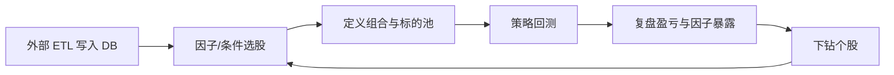

# 产品定位

## 一句话

**可自托管、可审计**的 A 股量化研究栈：读取外部灌入的行情与基本面 → **因子分析与选股** → 配置组合 → 策略回测 → 看图复盘 — PostgreSQL 落地。

## 目标用户

| 角色 | 目标 | 主要页面 |
|------|------|----------|
| **个人量化研究者** | 因子检验、条件选股、回测 policy | `/factor`、`/screening`、回测、结果 |
| **主动选股者** | 多因子筛选、建立候选池、跟踪自选 | `/screening`、`/market`、`/watchlist` |
| **引擎维护者** | 扩展因子、policy、复现回测 | `backend/app/core/`、任务、日志 |

**非目标用户**：需要在本系统内跑 Tushare 同步管道的人（**由外部系统负责**）；需要 L2/盘口、券商实盘、社交跟投的用户。

## 北极星动线

**成功标准**：在数据已由外部更新的前提下，用户在本系统内完成「多因子选股 → 回测 → 对比策略 → 查看失效因子/成交」，无需离开 SPA。

## 明确不做的事

| 类别 | 原因 |
|------|------|
| **本系统内数据同步** | 已由外部系统完成；本系统只读 `tushare` |
| 实时 L1/L2 行情 | 非研究核心；数据频率由外部管道决定 |
| 券商对接 / 实盘 | 合规与范围；模拟回测是边界 |
| 社交 / 跟单 | 与雪球类产品不同 |
| 完整 F10 / 资讯终端 | 高内容成本；可选外链 |
| Pine Script 运行时 | 使用 Python 因子与 policy |

## 竞争差异

| 对比 同花顺/东财 | 对比 聚宽 | 对比 TradingView |
|-----------------|-----------|------------------|
| 自托管因子与回测代码 | 引擎在仓库，非黑盒云端 | A 股因子 + policy 一体 |
| 选股条件可对接回测标的池 | 同一研究闭环 | 图表为辅，因子选股为主 |
| SQL/日志可审计 | 结果在自有 Postgres | — |

## 产品设计原则

1. **数据诚实** — 标明数据截至日期；同步责任在外部，本系统展示 `data/status`。
2. **因子与选股优先** — 新功能默认服务截面筛选与因子研究，而非采集。
3. **研究闭环** — 选股结果 → 自选 / 回测 / 个股因子 Tab。
4. **API 先于 UI** — 新选股规则先 API + 测试。
5. **引擎复用** — `StockTradeDataEngine`、`daily_basic`、未来 `factor_values` 共用。

## 演进主题

| 主题 | 说明 |
|------|------|
| 因子与选股 | **核心** — 见 [因子分析与选股](07-factor-and-stock-selection.md) |
| 行情浏览 | 辅助入口，条件可「复制到选股」 |
| 自选与回测联动 | 选股结果的落地页 |
| 体验与性能 | 全市场因子扫描变重时再优化 |

详见 [功能待办](04-feature-backlog.md)。
