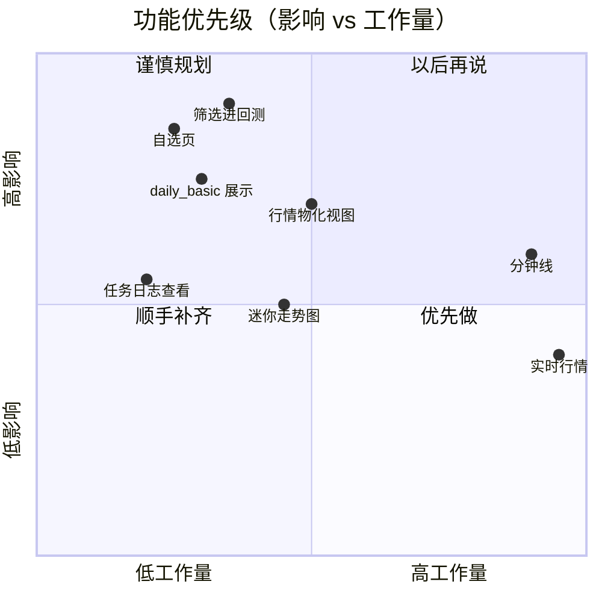

# 竞品能力研究

对标 **同花顺、东方财富、雪球、TradingView、聚宽**。用于交互参考与能力差距分析，**不**用于照搬 UI 或数据授权。

## 能力总览

| 能力 | 东财/同花顺 | 雪球 | TradingView | 聚宽 | 本系统 |
|------|------------|------|-------------|------|--------|
| 全市场列表 + 筛选 | ✅ 丰富 | ✅ | ✅ 筛选器 | ✅ | ✅ `/market` |
| 板块/行业涨跌 | ✅ 指数/加权 | ✅ | — | 部分 | ✅ circ_mv 加权 |
| K 线 + 成交量 | ✅ | ✅ | ✅ 专业 | ✅ | ✅ `/stocks/:tsCode` |
| 多周期 / 分钟线 | ✅ | 部分 | ✅ | ✅ | ❌ 仅日频 |
| 技术指标库 | ✅ 庞大 | 部分 | ✅ Pine | ✅ | ✅ 5 类折线 |
| 画线 / 形态工具 | ✅ | — | ✅ | — | ❌ |
| 自选 + 分组 | ✅ | ✅ 组合 | ✅ | ✅ | ⚠️ 仅 portfolio YAML |
| 条件选股 | ✅ 可视化 | 部分 | 筛选 | ✅ 因子 | ✅ ADF+趋势 job |
| 策略回测 | 部分 | — | 部分 | ✅ 核心 | ✅ 多 policy |
| 组合净值跟踪 | ✅ | ✅ | — | ✅ | ❌ |
| 资讯 / F10 | ✅ | ✅ 社区 | — | 部分 | ❌ |
| 实时行情 | ✅ | ✅ | 付费 | — | ❌ |
| 告警推送 | ✅ | ✅ | ✅ | 部分 | ❌ |
| 移动端 | ✅ | ✅ | ✅ | Web | ❌ |

## 同花顺 / 东方财富

### 核心价值

零售用户的 **行情 + 资讯 + 交易入口** 一站式。优势在广度与数据新鲜度，而非开放回测代码。

### 可借鉴

| 模式 | 说明 | 我们的动作 |
|------|------|------------|
| 列表 → 个股 | 点一行进 K 线，顶栏报价固定 | Phase 1 已完成 |
| 行业/概念条 | 板块涨跌，点击过滤 | 已完成（Tushare industry + circ_mv） |
| 板块算法 | 市值加权指数，非等权平均 | 行业条已采用 |
| 列自定义 | 用户自选显示列 | 待办 P2 — 列选择器 |
| F10 基本面 | PE/PB/ROE/股东等分页 | `daily_basic` 由外部灌库；缺 UI Tab |
| 资金流向 / 龙虎榜 | 短线叙事 | 除非 Tushare 高权限，否则不做 |

### 不宜照搬

- 实时五档、Level-2
- 开户/下单闭环
- 广告与信息流

## 雪球

### 核心价值

**自选 + 社区 + 组合展示** — 用持仓与收益获得社交认同。

### 可借鉴

| 模式 | 说明 | 我们的动作 |
|------|------|------------|
| 自选列表 | 独立页、按涨跌排序、分组 | **P0** `/watchlist` |
| 组合净值曲线 | 公开组合历史收益 | **P2** 模拟组合净值 |
| 个股讨论 | UGC | 不做 |
| 关注流 | 信息聚合 | 不做 |

## TradingView

### 核心价值

**图表交互**与 Pine 指标脚本的行业标杆。

### 可借鉴

| 模式 | 说明 | 我们的动作 |
|------|------|------------|
| 十字光标 + 区间统计 | 拖拽看区间涨跌 | **P1** 增强 ECharts |
| 多布局 / 周期切换 | 日/周/月一键 | **P2** 周期聚合 API |
| 指标叠在 K 线上 | 均线与蜡烛同图 | **P1** 合并 K 线与指标 Tab |
| 告警 | 价格/指标触发 | **P3** Webhook 告警 |

### 不宜照搬

- Pine Script 运行时（工程量巨大）
- 全球多资产类别

## 聚宽

### 核心价值

**研究平台**：标的池 → 因子 → 回测 → 归因，云端 IDE 一条龙。

### 可借鉴

| 模式 | 说明 | 我们的动作 |
|------|------|------------|
| 选股 → 回测一键 | 筛选结果作标的池 | **P0** 筛选对接回测 |
| 回测报告 | CAGR、夏普、回撤、逐笔 | `/simulation/results` 已大部分具备 |
| 因子数据层 | PE/市值/行业中性 | `daily_basic` + 未来因子表 |
| 参数面板 | MA 窗口、止损可见 | **P1** 筛选参数暴露到 UI |
| Notebook 研究 | Python 交互 | 我们就是 IDE（Web + 仓库代码） |

### 不宜照搬

- 云计算力市场
- 付费数据包捆绑

## 差距聚类（可执行）

## 行业分类说明

东财/同花顺使用 **自有板块指数**（申万/东财板块等）。我们使用 **Tushare `stock_basic.industry`** + **circ_mv 加权**。数值不会与终端 App 逐行一致；应在 UI 提示中说明。

## 参考

- 内部：[产品路线图](../product-roadmap.md)、[行情功能](../features/stock-universe.md)
- Tushare：`daily_basic`、`stock_basic`、`daily` 接口
