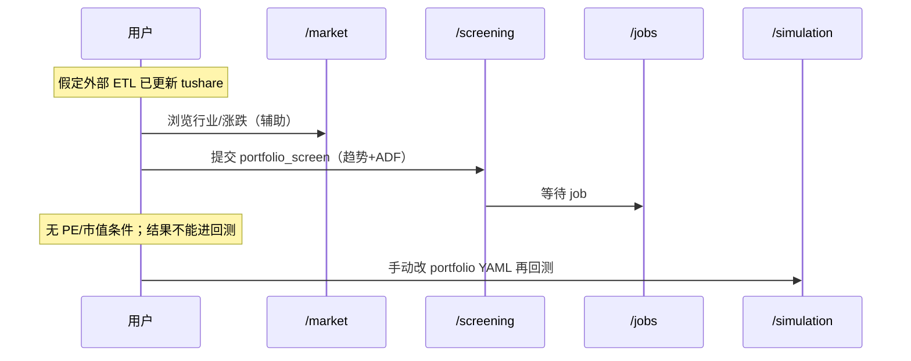

# 用户动线

描述用户在 SPA 中的典型路径、卡点，以及以**因子选股**为核心的理想动线。

> 数据由**外部系统**写入数据库；用户在本系统内**不执行同步**，仅确认数据新鲜度后开始研究。

---

## 动线 1：因子选股 → 回测

**角色：** 量化研究者  
**目标：** 用估值 + 动量等条件筛票，将结果送入回测。

### 现状

### 摩擦点

| 环节 | 痛点 | 改进 |
|------|------|------|
| 选股规则 | 仅趋势+ADF，无 `daily_basic` 因子 | F-501 基本面条件选股 |
| 结果 | 与回测标的池割裂 | F-503 一键送入 simulation |
| 行情 | 只能人工记代码 | F-202 结果链到 `/stocks/:tsCode` |

### 理想状态

1. `/screening`：多因子条件面板（PE、市值、动量、行业…）。
2. 保存为「选股预设」，可重复运行。
3. 结果页：**加入自选** | **创建临时组合并回测** | **导出 CSV**。
4. `/factor`（新）：单因子 IC、分层检验（研究向）。

---

## 动线 2：数据就绪确认（非同步）

**角色：** 任何用户  
**目标：** 确认库里有最新交易日数据再选股。

### 理想状态

1. 首页或 `/screening` 顶栏：`GET /api/data/status` — 各表最新 `trade_date`。
2. 若过期：提示「请联系数据管道」或文档链接，**无本系统 sync 按钮**。
3. `/market` 继续展示「数据截至 YYYY-MM-DD（非实时）」。

---

## 动线 3：回测与复盘

**角色：** 策略验证者  
**目标：** 对选股得到的标的池跑 MA vs 唐奇安，对比 CAGR。

### 现状与理想

与先前相同，额外增加：

- 回测摘要展示**标的池来源**（哪次选股 job / 预设名）。
- 成交表链到个股；个股页展示**当日因子分位**（阶段 D）。

---

## 动线 4：个股因子下钻

**角色：** 选股者  
**目标：** 看某票在截面中的因子位置。

### 理想 Tab

| Tab | 内容 |
|-----|------|
| 行情 | snapshot + K 线 |
| **因子** | PE/PB/动量等在全体/行业内的分位 |
| 指标 | 技术折线 |
| 估值 | `daily_basic` 明细 |
| 回测 | 该股历史 sim 成交 |

---

## 动线 5：自选管理

- `/watchlist` 聚合各 portfolio 的 `follow_stocks`（F-201）。
- 选股结果批量写入自选（F-203）。

---

## 已移除的动线

~~「在 `/data` 发起 data_sync」~~ — **不在本系统规划内**，由外部 ETL 负责。

---

## 与待办映射

| 动线缺口 | 待办 ID |
|----------|---------|
| 基本面/多因子选股 | F-501、F-505 |
| 数据新鲜度只读 | F-502 |
| 选股 → 回测 | F-503 |
| 因子研究页 | F-506、F-507 |
| 自选页 | F-201 |

详见 [因子分析与选股](07-factor-and-stock-selection.md)、[功能待办](04-feature-backlog.md)。
