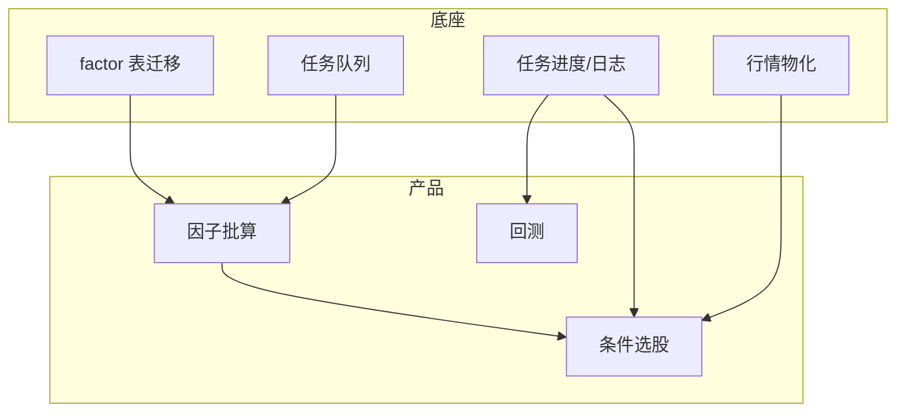

# 技术底座

支撑**因子选股、回测任务**的平台工程。数据同步不在范围内，任务重点变为 **factor_compute / factor_screen / simulation**。

---

## 当前约束

| 组件 | 实现 | 瓶颈 |
|------|------|------|
| 后台任务 | `JobService` 守护线程 | 全市场因子扫描无取消/队列 |
| 数据库 | 同步 SQLAlchemy | 单用户尚可 |
| 行情查询 | 5000 行 JOIN | 因子截面扫描更吃 CPU |
| 测试 | universe 测试为主 | 无 stock-pick / factor 测试 |

---

## 底座与功能关系

~~同步循环~~ — 不建设。

---

## E-1：任务基础设施（高）

**支撑：** F-503、F-504、F-505、F-210

| 任务 | 说明 |
|------|------|
| `Job.progress` | 选股/因子/回测阶段进度 |
| 日志查看 | `/jobs/{id}` 展示 log |
| job 类型扩展 | `factor_compute`、`factor_screen`、`stock_pick` |
| 取消标志 | 长时全市场扫描 |

---

## E-2：查询与因子存储（中高）

**支撑：** F-504、F-501、F-212

| 任务 | 说明 |
|------|------|
| 迁移 `004_factor_tables.py` | definitions + values |
| 物化 latest_quotes | 列表/自选 |
| 截面 rank SQL 或 pandas 批处理 | 选股引擎 |

---

## E-3～E-6

与前一版相同：多用户隔离（E-3）、API 一致性（E-4）、测试金字塔含 stock-pick（E-5）、前端 `/factor` 路由（E-6）。

---

## 部署说明（更新）

| 环境 | 说明 |
|------|------|
| 本系统 | `alembic upgrade head`；**无需**配置 Tushare sync |
| 外部 ETL | 负责灌入 `tushare`；与本系统解耦部署 |
| 联调 | 确认 `GET /api/data/status` 日期符合预期 |

---

## 遗留 sync 代码

| 路径 | 建议 |
|------|------|
| `app/core/dataset/sync.py` | 标记 deprecated；新功能不调用 |
| `data_sync` / `calendar_sync` job | UI 隐藏；后续 major 移除 |
| `/data` DataCollection 页 | 改为「数据状态」或移除 |

移除实现可单独排期；**文档与路线图已按「外部同步」更新**。

---

## 相关文档

- [因子分析与选股](07-factor-and-stock-selection.md)
- [功能待办](04-feature-backlog.md)
- [架构](../architecture.md)
