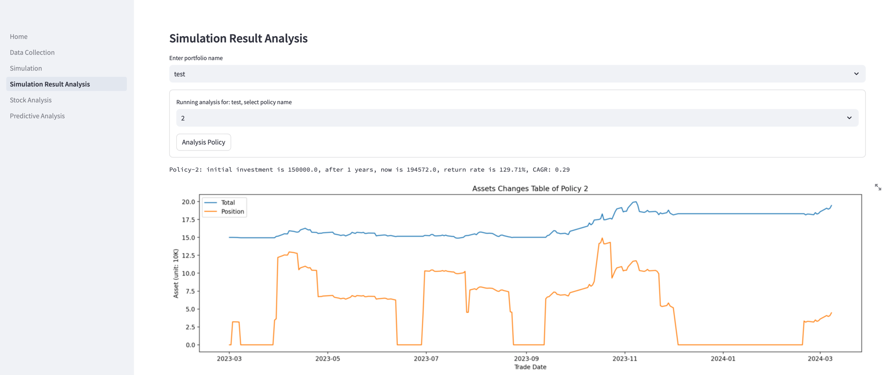

# 个人海龟交易系统 Turtle

本项目期望能为个人提供一个基于《海龟交易法则》的简单交易系统，帮助大家能够针对中国股票市场进行分析。

Turtle is a simple trade system based on a book named "Turtle Trading Rules".

## 安装 Installation
请参考[env.md](env.md)准备Python环境和数据库。

Please read [env.md](env.md) to prepare Python environment and Database.

## 使用 Usage

### 数据收集 Data Collection
第一次运行系统时，运行以下脚本，从tushare下载数据。

Run scripts to download data from tushare when you first run the system.
```bash
PYTHONPATH=src python3 src/dataset/update_stock_trade_daily.py --start 2015-01-01
PYTHONPATH=src python3 src/dataset/update_trade_calendar.py
```
每天收盘后运行以下脚本，更新当日的数据。

Run scripts to update daily.

```bash
PYTHONPATH=src python3 src/dataset/update_stock_trade_daily.py
```
注意: 如果出现找不到模块的错误，请检查并添加PYTHONPATH环境变量。

Note: If throw no module found error, please add PYTHONPATH environment variable.

### 回测 Simulation
运行以下脚本进行回测。

Run scripts to simulate
```bash
PYTHONPATH=src python3 src/main.py
```
可以指定不同的投资组合和开始时间并进行回测。

You can specify different portfolio and start time to simulate.
```bash
PYTHONPATH=src python3 src/main.py --configure test.yaml --start-date 2022-01-01
```

### 通过Web UI访问
当数据收集成功之后，可以通过以下命令启动Streamlit应用。
```bash
PYTHONPATH=src streamlit run src/Home.py
```
Streamlit的界面如下：可以进行数据收集、回测、分析等操作。


也可以通过以下命令启动jupyter在notebook中分析数据。详情请参考src/notebook目录下的notebook文件。
```bash
jupyter lab
```

### 设置投资组合以及回测参数 Set Portfolio and Simulation Parameters
请参考[portfolio.yaml](portfolio.yaml)来设置个人投资组合。
```yaml
---
name: portfolio                                 # 投资组合名称
start_date: 2023-02-17                          # 回测开始时间
initial_investment: 250000                      # 初始投资金额
increase_investments:                           # 追加的投资列表
  - date: 2023-03-17                            # 追加投资的日期
    amount: 100000                              # 追加投资的金额
  - date: 2024-01-01
    amount: 100000
follow_stocks:                                  # 关注的股票代码
  - '600519.SH'                                 # 您可以将您关注的股票代码添加到这里
  - '000858.SZ'  
risk_control:                                   # 风险控制参数
  bearable_trading_loss: 0.01                   # 当日可承受的最大亏损比例
  position_control: 1.0                         # 仓位控制比例，1.0表示允许满仓
  position_control.reserve_profit: 0            # 保留多少比例的利润不用于继续投资（购买股票）
  max_position_size: 50                         # 交易最大头寸单位，50意味对单支股票最多购买50手
  max_position_ratio: 0.5                       # 交易最大头寸占总资金的比例，0.5意味着单支股票的投资最多占总资金的一半
  stop_loss_point.should_check: True            # 是否启用止损
  stop_loss_point.n_times_atr: 2                # 止损点设置为n倍ATR
  stop_loss_point.should_update: True           # 是否每日更新止损点
  max_holding_period.should_check: True         # 是否检查个股的最大持仓期
  max_holding_period.days: 80                   # 个股的最大持仓天数，80天
policies:                                       # 交易策略列表
  - trade_policy.name: moving_average           # 交易策略的模块名称，根据配置，此策略为双重移动平均线
    trade_policy.moving_average.triple: False   # 不使用三重移动平均线
    trade_policy.moving_average.window_1: 10    # 第一个移动平均线的窗口大小
    trade_policy.moving_average.window_2: 60    # 第二个移动平均线的窗口大小
    trade_policy.moving_average.should_price_higher_than_ma: True   # 价格高于均线才买入
  - trade_policy.name: donchian                 # 交易策略的模块名称，根据配置，此策略为唐奇安通道
    trade_policy.donchian.ma_window_1: 20       # 用于判断趋势的第一个移动平均线的窗口大小
    trade_policy.donchian.ma_window_2: 70       # 用于判断趋势的第二个移动平均线的窗口大小
    trade_policy.donchian.up_days: 20           # 唐奇安通道上轨天数，价格高于20日最高价才买入
    trade_policy.donchian.down_days: 10         # 唐奇安通道下轨天数，价格低于10日最低价才卖出
  - trade_policy.name: moving_average           # 交易策略的模块名称，根据配置，此策略为三重移动平均线
    trade_policy.moving_average.triple: True    # 使用三重移动平均线
    trade_policy.moving_average.window_1: 10    # 第一个移动平均线的窗口大小
    trade_policy.moving_average.window_2: 60    # 第二个移动平均线的窗口大小
    trade_policy.moving_average.window_3: 70    # 第三个移动平均线的窗口大小
  - trade_policy.name: ensemble                 # 交易策略的模块名称，根据配置，此策略为集成策略
    trade_policy.moving_average.triple: False   # 不使用三重移动平均线
    trade_policy.moving_average.window_1: 10    # 第一个移动平均线的窗口大小
    trade_policy.moving_average.window_2: 60    # 第二个移动平均线的窗口大小
    trade_policy.donchian.ma_window_1: 20       # 用于判断趋势的第一个移动平均线的窗口大小
    trade_policy.donchian.ma_window_2: 70       # 用于判断趋势的第二个移动平均线的窗口大小
    trade_policy.donchian.up_days: 20           # 唐奇安通道上轨天数，价格高于20日最高价才买入
    trade_policy.donchian.down_days: 10         # 唐奇安通道下轨天数，价格低于10日最低价才卖出
  - trade_policy.name: atr                      # 交易策略的模块名称，根据配置，此策略为ATR策略
    trade_policy.atr.ma_days: 30                # 移动平均线的窗口大小
    trade_policy.atr.atr_days: 20               # ATR的窗口大小
    trade_policy.atr.up: 3                      # ATR的上轨，3倍ATR
    trade_policy.atr.down: 1                    # ATR的下轨，1倍ATR
  - trade_policy.name: bolling                  # 交易策略的模块名称，根据配置，此策略为布林策略
    trade_policy.bolling.ma_days: 30            # 移动平均线的窗口大小
    trade_policy.bolling.up: 2                  # 布林线的上轨，2倍标准差
    trade_policy.bolling.down: 1.5              # 布林线的下轨，1.5倍标准差
```